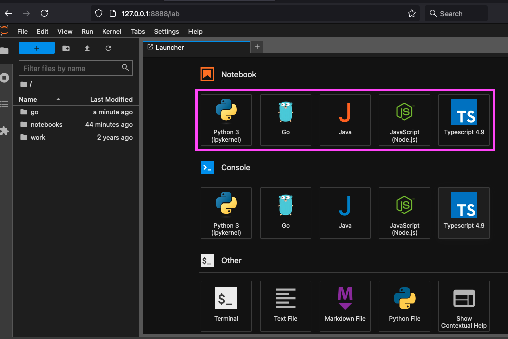

# About

Containerized [Jupyter Lab Scientific Python Stack](https://hub.docker.com/r/jupyter/scipy-notebook) runtime Ubuntu environment with kernels to execute [Java](https://github.com/SpencerPark/IJava), [Go](https://github.com/gopherdata/gophernotes), [Node](https://github.com/n-riesco/ijavascript), [TypeScript](https://github.com/yunabe/tslab), and Python code.



Aldo, by using the [built-in magic commands](https://ipython.readthedocs.io/en/stable/interactive/magics.html#built-in-magic-commands) and [IPython extensions](https://ipython.readthedocs.io/en/stable/config/extensions/index.html), this template provides the developer with features such as[`autoreload`](https://ipython.readthedocs.io/en/stable/config/extensions/autoreload.html#autoreload) out of the box. The Docker volume mapping configuration provides persisted state for all notebooks and modules.

# Run Locally

> ⚠️ stable-ish, proceed with caution

## Requirements

[Docker](https://docs.docker.com/)

```
Client: Docker Engine - Community
 Version:           18.09.2
 API version:       1.39
 Go version:        go1.10.8
 Git commit:        6247962
 Built:             Sun Feb 10 04:12:39 2019
 OS/Arch:           darwin/amd64
 Experimental:      false

Server: Docker Engine - Community
 Engine:
  Version:          18.09.2
  API version:      1.39 (minimum version 1.12)
  Go version:       go1.10.6
  Git commit:       6247962
  Built:            Sun Feb 10 04:13:06 2019
  OS/Arch:          linux/amd64
  Experimental:     true
```

## Steps

1. Clone
2. Setup `.env` as outlined in `~/.env.template` file
3. Run `bin/build.bash` (no need to re-run the build if there are no new Docker-related or configuration changes)
4. Run `bin/run.bash`, monitor the terminal outputs, then visit [http://127.0.0.1:8888/lab](http://127.0.0.1:8888/lab) to access the interface

### Additional Runtime Commands

| Command | Details |
| -------- | ------- |
| `bin/exec.bash` | Tunnel into the running then open a [interactive shell session](https://docs.docker.com/reference/cli/docker/container/exec/) |
| `bin/test.bash` | Run tests |
| `bin/setenv.bash` | Injects environment variables from the `.env` file into runtime environment |

Note you can pass [Docker flags](https://docs.docker.com/engine/reference/run/) to executables such as `bin/build.bash --no-cache`
